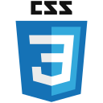
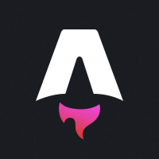
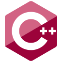
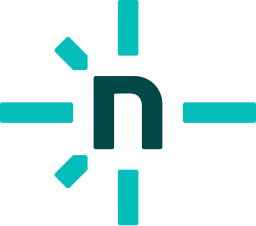
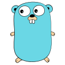

## About Me

Hi there, I'm a student from Nanjing University of Science and Technology, major in Material Science and Specialized Welding,
and focused on higher-level controlling and code infrastructure.

I'm participating in the competition RoboMaster in @Alliance-Algorithm
as a software developer.

I'm also a capsuleer in [EVE Online](https://www.eveonline.com)!
Check my repositories to find applications for the New Eden!

<picture>
  <source media="(prefers-color-scheme: dark)" srcset="assets/github-contribution-grid-snake.svg" />
  <source media="(prefers-color-scheme: light)" srcset="assets/github-contribution-grid-snake-dark.svg?palette=github-dark" />
  
</picture>

## My passions and focus

Besides techs used for material science and engineering,
I'm also dedicated to utility software developing and partially tooling UI/UX, and serving documents on cloud.

I have been using multi-language monorepo for long
and I'm trying to build a cross-language cross-tech-basis
flexible build utility and scaffold!  
If you are interested in building infrastructure,
contact me as I'm willing to share and talk about my experiences.

### Skills

<table><tr><td valign="top" width="33%">

#### Frontend  

  
  
  
  
  
  
  
  
  
  

</td><td valign="top" width="33%">

#### Backend  

  
  
  
  
  

  
  
  
  

</td><td valign="top" width="33%">

#### DevOps  

  
  
  
  
  
  

</td></tr></table>  

### Learning

  
  
  
  

## My Projects

| Project                                                                      | Field               | Languages                    | Description                                                                                                              |
| ---------------------------------------------------------------------------- | ------------------- | ---------------------------- | ------------------------------------------------------------------------------------------------------------------------ |
| [EVE Multitools](https://github.com/Embers-of-the-Fire/EVE-Multitools)       | Desktop Application | Python + Rust + TS(X)        | Comprehensive toolset for EVE Online players, providing market analysis, character management, industry tools, and more. |
| [EVE Fit Assistant](https://github.com/Embers-of-the-Fire/eve-fit-assistant) | Mobile Application  | Python + Rust + Flutter/Dart | Mobile fitting utility for EVE Online®, built with Flutter                                                               |
| [EVE Fit OS](https://github.com/Embers-of-the-Fire/eve-fit-os)               | Library             | Rust + Python                | A fitting simulator system for EVE, in Rust                                                                              |
| [Stellaris Docs/Next](https://github.com/Emebers-of-the-Fire/pdxdoc-next)    | Document Website    | Astro                        | Documentation for the game Stellaris                                                                                     |
| [Nonad STD](https://github.com/Embers-of-the-Fire/monad-std)                 | Library             | Python                       | A library of rust-styled monad utils for python.                                                                         |
| [valust.rs](https://github.com/Embers-of-the-Fire/values-rs)                 | Library             | Rust                         | Automatic value validator framework for Rust.                                                                            |

## My Stats

